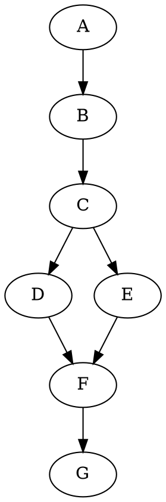

# Secure Messaging Meet-up Notes
Date: 31/01/2019
[Meetup Link](https://www.meetup.com/Pre-FOSDEM-Messaging-Workshop/events/257926909/?isFirstPublish=true)
[Riot Channel](https://matrix.to/#/!hihNpRPSwQUkWvIJxS:matrix.org?via=matrix.org&via=matrix.parity.io&via=status.im)
Status Channel: `#status-protocol`

Participants:
- Corey Petty (Status)
- Oskar Thoren (Status)
- Iuri Matias (Status)
- Anthony Laibe (Status)
- Jacek Sieka (Status)
- Benjamin Kampmann (Parity)
- Joshua Mir (Parity)
- Jeffrey Burdges (W3F)
- Peter Czaban (W3F)
- Fatemeh Shirazi (W3F)
- Robert Kiel (Validity Labs)
- Benjamin MATEO (Cogarius)
- Maxime DEKONINCK (Cogarius)
- Ulrich Petri (brainbot, Raiden Network)
- Matthew Hodgson (matrix.org)
- Alex Puig (Caelum labs)
- Marc Juarez (KU Leuven, PhD student on traffic analysis)

## Resources
- [w3f messaging repo](https://github.com/w3f/messaging)
    - See [`issues`](https://github.com/w3f/messaging/issues)
- [SoK evaluation of Status](https://notes.status.im/sDKuBAiPSH6iB9cFmEKLyg)
    - WIP
- [SoK evaluation of Mixnets](https://notes.status.im/SHzCAVFHTKiTwl6snqED3w)
    - WIP
- [Post on EthResearch Forum](https://ethresear.ch/t/whisper-v2-request-for-requirements-for-eth2-unified-messaging-protocol/4808)
- [Status Protocol Stack Presentation](https://notes.status.im/status-protocol-stack)

### SoK Papers
- https://www.esat.kuleuven.be/cosic/publications/article-2706.pdf page 4
  
- http://cacr.uwaterloo.ca/techreports/2015/cacr2015-02.pdf page 19
  
- [Awesome Secure Messaging List](https://github.com/status-im/awesome-secure-messaging)

### Mixnet engeneering
- Katzenpost - https://github.com/Katzenpost/
- [HOPR - Incentivised privacy-preserving messagaing protocol](https://github.com/validitylabs/messagingProtocol)
- [Sphinx packet format usage](https://github.com/burdges/lake/tree/master/Xolotl/papers)

# Day 1
### Introduction
Purpose of workshop is to come together to "get on the same page" of messaging for decentralized technologies.  Hopefully to get together on shared requirements of messaging across community. 
- [oskar] mention of [desired outcomes](https://docs.google.com/document/d/1i_0xRRhwNvA8tEeP7nY6_0i0a-yZNvqZ-GTj1bmjY2I/edit#)
    - Framework (addition) 
    - Scope
    - Requirements
    - Narrow Down Solution Space (addition)
    - Big Decisions
    - Specification 
    - Follow Up Procedure

- Get to common framework of what the problem is, break it into chunks of what we want to tackle. 

### Wider Conversation
- We aren't doing this for political reasons, just to make clear.
- A general point is that whatever solution we come up with, they don't need to be tied to any solutions out there.  We should leverage what we know and have experience with, but we shouldn't restrict ourselves to it. 
- Most of us are coming from decentralized application space, which comes with a certain frame of mind

### Requirements
General concepts needed to address. Some of these requirements are applicable in general and some are specifically relevant to private messaging. Many of these requirements impact others.
- Privacy/security
    - post-quantum (future work) 
    - adversary model
    - properties: forward security? receiver anonymity?
    - IP Protection
    - repudiation?
- Usability (dev and end-user)
    - documentation
    - interfaces
    - high-level consequences / options
    - not reliant on any other specific protocol (e.g. ethereum for incentivization)
    - ability to interface with multiple languages
    - configuarbility/modularity: tweeking trade-offs
    - simple interfaces
    - features: e.g., keeping history or not
- non-use cases
    - voip
    - large files
- performance
    - latency
    - message size limits
    - ease of join and leave
- use SoK paper for secure messaging as feature set to evaluate (see resources)
    - doesn't quite capture everything, but is a good start
- Scalability (see readme walkthrough section)
- P2P Architecture
    - multiple devices per users
    - how does PKI work for nodes?
- Upgradability 
    - lessons from Matrix
        - ability to migrate
        - versioning in the protocol (easy)
        - governace
        - ability to migrate transparently between version numbers
        - sensible way of informing users of upgrade (in a decentralized context) is difficult
        - what does it look like? number / string
            - how do you come to consensus on this, and how deep in the stack does that governance exist?
        - lots of these lessons are dependant upon persistance (maybe not...)
- Persistence (message storage)
    - We have to be careful of where (in the stack) we put this, or we end up creating multiple protocols, some of which are identical to what exists
    - we clearly want persistance and not...... 
    - It's too constraining to get a privacy preserving layer while also having persistence
    - potentially solved through multi-device synchronization
        - care here due to "ghost devices"
- Asynchronicity 
- Resource Usage
    - Devices to run on: IoT, mobile, PC
- Incentives
    - having something global for incentives requires singleton at the base/middle of everything, which has strong consequences for scalability
    - even if it's secure, there are ver good chances that we can't prove that it is secure
    - we want nodes that do useful work to be incentivized (self-sufficiency)
        - no altruism
    - thought for stablecoin
    - flexible accounting: looking for accounting level between nodes
        - need some unit of measure for balancing consumption and provision
        - methodology for this:
            - coin attached to packet
            - certificate of the thing
            - payment channels with thing
            - scheme that prints money for nodes for correct routing
            - sender burn to send ([Iuri proposal](https://discuss.status.im/t/prbs-protocol-proposal-an-incentivized-whisper-like-protocol-for-status/849))
    - don't think you can extract enough value form use to prevent spam
    - payout for packet vs payout statistically
        - payout for relay of packet instead of packet itself (successful work)
    - require unit of measurement to be evaluated
        - economic theory can only be derived from this
            - packet spec is probably this
    - we require a rubric of productive work as a function of the unit of measurement
        - see https://projectchicago.io/ for study of pricing of cryptocommodites
        - cover traffic
        - relay of packet
        - storage of packet (lifetime of storage)
    - potential solution (jeff)
        - sending packets is free
        - nodes have stake, they produce cover traffic
        - payout to staked/unstaked nodes based on performance (time based?)
        - printing money for nodes for working correctly (being useful)
        - very orthogonal to underlying transport and very fast
        - VRF somewhere in here (PLEASE ADD WHERE RELATIVE)

Reiterate that offline capability is important, as most devices have high churn with respect to availability

### Solution Space
One important consideration is what kind of applications are building on top of this?
- informs what layers are used for and their individual scope

#### Apps to be build on this (high-level)
- IOT / machine-to-machine comms
- chat app with media
- state channels
- DID claim sharing
- broadcasting announcements, notifications
- multi-but-few recipients, numerous recipients is out of scope
- collaborative docs

#### Oskar gave Status Protocol Review Presentation (see resources for link)
https://notes.status.im/status-protocol-stack

Questions:
- What do you mean by censorship resistance.  Is this app or network level?
    - we mean both.  libp2p allows pluggable transports so blocking becomes difficult, as well as app level social censorship through incentivization schemes but allow user liberty
- What about traditional moderation, admins, etc?
    - We dont want to do that, we want to enable micro-communities to do that themselves, how they want to do it. 
        - per room/consumer/etc

#### Matthew discusses Matrix
- goals:
    - e2e encryption 
    - decentralization
- client/server for end user through http
- servers are federated
    - arbitrary data synchronization ~~later~~ today
    - open JSON database with pub/sub semantics than a "messenging system"
- a lot like usenet or git in a data replications perspective
- spec proposal right now that allows data retention rate per room
    - supports burn after reading
    - supports time-based specification
    - https://github.com/matrix-org/matrix-doc/blob/matthew/msc1763/proposals/1763-configurable-retention-periods.md
- 30,000 nodes in the network right now
    - some are massive (7M users; >1M msgs/day)
- very popular with governments (e.g. french, 5 other governments)
    - they like decentralization (geographical split & lots of loosely coupled orgs)
    - really like e2e encryption
    - like open-source (vender neutral)
- current option for decentralization with actual granularity
- emphasis on conversation history because they want to replace telegram, slack, etc.
- initially made errors in protoocol (versioning)
    - didn't have content-addressable hashing
    - needed to change consensus algorithm
        - poeple in a room need to agree on some things.
        - hard to solve with a partial DAG
        - consensus operates on important sub-states
- want to migrate to p2p and move away from DNS

A typical room DAG showing a netsplit and subsequent merge:

- did not work on meta-data protection, its rather a second priority
- having meta-data stacking on end-user clients already solves a big problem with respect to all meta-data accumulating in centralized architectures
- encryption: double ratchet (olm) + shared ratchet (megolm)
- 5-to-1 ratio on client-facing versus server-facing focus
- Status has done something quite opposite to Matrix, they focused on stack first and dealt with end user features later, Matrix focused on end-users and focused on specifying stack later, neither are optimal (probably)
- questions:
    - consensus problems with DAGS
        - you need to have a globally consistent view
        - MLS side of things only does time-based sync
        - doesn't work for long term offline users (submarine needing to resync worldview example)
    - imagine that i want to run a matrix node on a phone, what do you run into?
        - we have them right now
        - one of the problems is codebase is Synapse in python (big)
        - also database is in sqlite and is inefficient
        - talking a couple GB of ram for a server which supports large rooms
        - resources usage scales with complexity of room (size of DAG that you have to resolve)
        - structurally (protocol perspective) you're fine
            - dendrite as implementation example which is ~10-100x more resource efficient than synapse)
        - other problem is DHT and peer discovery (Status feels this)

#### Validity Labs discusses HOPR (see resources)
- messaging protocol
- stack:
    - some application on top
    - HOPR (inside libp2p)
    - libp2p 
    - network
- Sphinx packet headers
- something like an accounting scheme between nodes
- Need some way to prove message was successful
- requirement that at least one of the nodes in between needs to be honest
- Simpe Description: Lets assume we have three nodes $A$, $B$, $C$. They share pairwise keys. Nodes can only unlock the payment by correctly relaying messages. $A$ includes  payments into the message header encrypted with key $K_{AB}$ and $K_{BC}$. $A$ can take his payment once $B$ ackwnoledging it has received the message. However, only if the message successfully arrives at the receiver.
- you dont know when it receives it's final destination, but when it has reached and money is paid, then ????
- require ledger to act as judge/arbitor
- another idea is to have adaptable anonymity
- only needs ledger that is able to verify signatures and hash arbitrary messages
- you can use the ledger as a directory service?
- questions:
    - lets assume messages hops A -> Z, from point of view of A, what does he know?
        - to prove that b has really relayed message to C, the idea is to have some acknowledgement which contains a key and the sphinx header allows every node to ?????
    - observation: interesting system w.r.t. incentivization.  Matthew thinks incentive space is fascinating in general. Matrix is trying to avoid financial incentives at all.  Most people don't think about social incentive, and only consider value incentive.  Matrix is attempting to do this by tracking reputation based in spam and abuse, and use that. 
    - Can this be sybil attacked w.r.t. intermediate nodes?
        - this is why we need the ledger
    - How does A choose nodes? How do availability requirements work?
        - send same message over multiple routes
        - tunable to how reliable you need message
        - (might require proof of uptime or some form of signal)
    - incentive for relaying ack?
        - each node signs a puzzle ack to sender
        - if there weren't receival, provides proof to block payment

#### W3F (Jeff) and (Validity) Robert discuss libp2p
- some things ned to be improved in libp2p
- modules:
    - transport
        - TCP
        - webRTC
        - websockets
        - UDP (maybe)
    - muxos 
        - mplex
        - google quick thing (??? lookup)
    - secIO/TLS
        - SecIO
        - TLS
    - peer discovery
    - node level encryption, not enforced globally (`is this right ????`)
    - conceptually, overlay network could be implemented (no api for it yet)

#### W3F (Jeff) talks about mixnetworks
- implementations:
    - katzenpost
        - have a lot of input from people about cover traffic and what it should be like
        - much closer than anyone else to have reasoning behind cover traffic decisions
        - a problem is that they are not a decentralized protocol
        - we want input from academics behind this project
    - nym
        - originally EU funded consortium
        - not completely sure what differences are, they have similar goals
    - panoramix

#### Iuri (status - embark) discusses (see #resources for more detailed proposal)
- disclaimer, we don't propose this is better, its just another view
- someone who is an active participant in the network should be free to send messages
- basic idea:
    - two nodes connected to some relayers, which is connected to a sender
    - receivers are willing to earn to relay messages
    - senders pay to send
    - **participate in relaying messages until you accumulate enough to send**
- no guarantees of delivery
- we see an issue with possible sybil attacks

#### W3F (Jeff) other strategies for incentivization
- blind signatures
    - heavy and slow
    - real overhead is the double spending protection database
    - you could do re-blindable certificate (charging access to network)
        - not sure if there is an efficient re-blinding scheme
        - current is coconut
            - requires 4 pairings to check a certificate, but that's heavy
            - cool because is a gateway into the network
        - makes sense for something like katzenpost when they were designing it
- attempt to make any of these payment schemes probabalistic
    - literally only pay for cover traffic that wins some sort of lottery
    - extra overhead per hop is zero
    - bad/good thing, there is no spam protection from payments, sending is free 
    - method for currency distribution
    - need to limit VRF keys due to lottery attack
    - end goal, encourage privacy centric behavior, make them pay for violations of it

#### Brainbot (Ulrich) discusses Raiden Network
- payment channel network
- channels between two nodes are called netting channels and are formed by 2 unidirectional channels
- intermediate nodes will take fees for relaying
- using hash-time locks and merkle trees
- using Matrix for communication between nodes
    - pretty happy with Matrix overall
    - some conceptual mismatches
    - gives e2e encryption for free
    - previously used a homegrown UDP p2p protocol
    - libp2p wasn't a mature option when the decision for Matrix was made
```graphviz
digraph G {
  graph [nodesep=2, compound=true];
  newrank=true;
  splines=false;

  subgraph cluster_node_a {
    a0 -> a1 -> a2 -> a3 -> a5 -> a6 [style=invis];
    label = "Alice";
    color=white;
  }

  subgraph cluster_node_b {
    b0 -> b3 -> b4 -> b5 -> b6 [style=invis];
    label = "Bob";
    color=white;
  }

  subgraph cluster_node_c {
    c0 -> c1 -> c2 -> c3 -> c4 [style=invis];
    label = "Charlie";
    color=white;
  }

  a0 [style=invis];
  a1 [style=invis];
  a2 [style=invis];
  a3 [style=invis];
  a5 [style=invis];
  a6 [style=invis];
  b0 [style=invis];
  b3 [style=invis];
  b4 [style=invis];
  b5 [style=invis];
  b6 [style=invis];
  c0 [style=invis];
  c1 [style=invis];
  c2 [style=invis];
  c3 [style=invis];
  c4 [style=invis];

  a0 -> b0 [label="LockedTransfer", lhead=cluster_node_b, ltail=cluster_node_a];
  b0 -> c0 [label="LockedTransfer", lhead=cluster_node_c, ltail=cluster_node_b];
  c1 -> a1 [label="SecretRequest", lhead=cluster_node_a, ltail=cluster_node_c];
  a2 -> c2 [label="RevealSecret", lhead=cluster_node_c, ltail=cluster_node_a];
  c3 -> b3 [label="RevealSecret", lhead=cluster_node_b, ltail=cluster_node_c];
  b4 -> c4 [label="Unlock", lhead=cluster_node_c, ltail=cluster_node_b];
  b5 -> a5 [label="RevealSecret", lhead=cluster_node_a, ltail=cluster_node_b];
  a6 -> b6 [label="Unlock", lhead=cluster_node_b, ltail=cluster_node_a];

  {rank=same; a0; b0; c0; }
  {rank=same; a1;     c1; }
  {rank=same; a2;     c2; }
  {rank=same; a3; b3; c3; }
  {rank=same;     b4; c4; }
  {rank=same; a5; b5;     }
  {rank=same; a6; b6;     }

}

```
*(ack messages are not shown)*
- A single payment with one hop currently takes ~2 sec
    - with the discussed ~5 sec latency per message (see above), a single payment would take around ~30 sec
    - this use case wouldn't work then on such a latency
- not useing Matrix room history because of ordering requirements
    - we have to process each message in order because of nonce of each message in channel
    - you have to apply all messages in order to reconstruct merkle tree the same way the sender creates it
    - you can end up with stuck channels if messages are missing

### Readme Walkthrough
Adversary Model:
- global, passive adversary with some active capabilities

Metadata protection:

1. Sender Anonymity (who sent a message?): against the receiver also or only against the adversary?

2. Receiver Anonymity (who read a message?)

3. Sender-Receiver Unlinkability (who is talking to whom?)
    - repudiation?

Convenience, Usability:

4. Reasonable Latency (<5s, to allow for IM [XXX])
    - in order to have network level privacy against a global adversary, need to add low-level latency and cover traffic
        - if you don't have one, not sure if having the other helps (see timing attacks of Tor (burst/witholdinging/etc))
    - potential to get (Tor/mixnet-like) latency down to 
    - Matrix demonstration that after 2-3 seconds, message growth stopped flat ( > 1 sec is too much for slack-like apps )
    - state-channels also require low-latency
    - discussion overview: we will require low-latency, and medium-latency options for apps that are ok with around < 10 sec, but all having stronger privacy/security properties
    - two ways to specific on mixnet packet (PLEASE FIX, DIDN'T CATCH ALL HERE)
        - byte field
        - sample from exp distribution

    Relevant papers:
    - [Anonymity trilemma](https://eprint.iacr.org/2017/954.pdf)
    - [UX](https://www.nngroup.com/articles/response-times-3-important-limits/) and [response time](https://www.nngroup.com/articles/powers-of-10-time-scales-in-ux/)

5. Reasonable Bandwidth (not specified, mobile data plan in undeveloped countries)
    - at least keep in mind the severe limitations of underdeveloped countries, and the fundamental impact on their data plans.
    - rough expected tradeoff: half the latency, double the bandwidth
    - other mobile consideration is battery
        - cover traffic packets when plugged in (requires configurability at some point)
    - Example of notification servers
        - how are we going to have our own?
    - Potential for "service-level" network that affords some trust
        - change network traffic pattern in comms above service level
    - Matrix working on bandwidth in last month or two (government interest)
        - working from general theoretic "how low can you go" perspecitve (**PLEASE FILL IN DETAILS HERE AND FIX WHAT I PUT**)
            - 100 bits/s
            - 6-7 messages a minutes
            - use of CoAP + CBOR + noise 
            - everything through shared deflate dictionary
            - requires predictable shape of data
            - client/server API and server/server API
            - binary spanning tree over participating nodes
            - open sourced soon (this weekend?)
            - More details: 

6. Adaptable Anonymity (adjustable resource consumption)
    - probably not a goal at all, we can find a common ground here

Decentralization:

7. Scalable (up to, say, ~1M active nodes)
    - fulfill other requirements with respect to: 
        - active nodes
        - messages/time
        - informed by node heirarchy/network topology ratios
            - relays/users/etc
    - Tor has 200x users than relays
        - we can do better
    - mixnet contraint on scale
        - users need to get respectable portion of mixnode keys 
            - node keys rotate ~1/month
        - classical idea is that users know all node's keys so they can uniformly sample

8. No Specialized Services (pure p2p)
    - multi-device is a standard, and will continue
    - full/light nodes
        - there will be some relaxation from base layer to serve lower-resource clients
    - synergy with other protocols

Incentives to achieve mass adoption:

9. Incentivisation for relayers (not necessarily economical)
    - requires some interaction with a blockchain
        - clear we want to interact with other protocols
        - it might run on the same node or same application, but not specifically on the same client
    - incentivazation in ethereum now:
        - gas for computation not a good representation for storage or messages
        - becomes difficult to run two networks with two different types of resource contraints on a single device
        - introduction or rent
        - reasoning: one metric will run into another wall
    - the major cost will be key exchanges (asym cryptography base)
        - this is the same cost of running a blockchain node


## Devices to consider (churn/bandwidth/compute/power resources)
- IOT / Embedded Devices
- Mobile
- Desktop
- Server

## Closing session

#### Jacek (Status - Nimubs) discusses Whisper and PSS
##### Whisper
- [Whisper and PSS comparison](https://our.status.im/whisper-pss-comparison/)
- not a messaging protocol, but an actual shared state database
- nodes receive message multiple times, only repeat once
- darkness of routing is quite strong
- like a key-value store but multiple values per key 
    - key = "topic"
- mitigation strategies:
    - node says only interested in certain topics (bloom filters)
- the sender encrypts it with the receiver key, everyone sees the message and tries to decrypt, but cant (burden on batteries)
- sender can send cover traffic, and repeat received traffic to obfuscate his messages
    - eclipse attack is only way to differentiate
- PoW in message to reduce spam (Status doesn't use this)
    - relayers only relay messages with appropriate PoW
    - also can prioritize based on their resource drain
        - actually prioritized by PoW/TTL by default
- spamming very inefficient
- result: recipients choose what to listen to / relay
- nice trade-off between latency and privacy
- sender only needs the pub-key of the receiver to send a message
- incredibly resilient to failures / bifurcations


##### PSS
- is based on incentivization system (kinda)
- classical DHT address space
- can partiall mask recipient address
    - some part of the path is deterministic (kademlia)
    - masked part is gossiped
- result: sender chooses how anonymous the message should be

#### W3F (Jeff) intro to SURBs
- instruction that allows 3rd party to prepare message to me
- DIAGRAMS GO HERE
- [SURBS](https://cypherpunks.ca/~iang/pubs/Sphinx_Oakland09.pdf)
- https://katzenpost.mixnetworks.org/docs/specs/sphinx.html#single-use-reply-block-surb-creation
    - SURBs require intermediate nodes; with permission-less join/leave this could be a problem for reliability (HA req)
- used only once 
    - a SURB packet header can be used only once so key exchange can't happen again in replay protection database
    - ~ cross-over points mixnet?
    - also for forward secrecy

## Solution Elements
- accounting for unit of measurement and the associated work performed based on it
- p2p layer
    - base on libp2p
    - noise handshake
        - [noise link](http://noiseprotocol.org/noise.html)
    - ensure spec
    - todo below in list =>
- packet format: arbitrary data passing
    - constraints here:
        - everything enctrypted (e2e)
        - fixed size blocks (def question here on what size)
    - we could use [Sphinx](https://katzenpost.mixnetworks.org/docs/specs/sphinx.html)
    - downside: 
        - must know keys of all routers involved
        - needs a lot of computation to build it (fair)
    - modifications
        - another 16bit stream cyphered encrypted field to support more fancy SURB cases (unmaced)

- certain degree of censorship resistance
- should be able to join and leave at will
    - relatively short timespan for each
- relay PKI / Find initial nodes
    - findFairSubset() without leaking anything about this subset or themselves
- routing (see below, day 2)
    - whisper didnt have optomal routing 
- Joining/leaving process (see below)
- message storage
    - SURBs potentially quite useful here, however, if the system has churn it becomes difficult
- syncing


Note: Scaling limit of Tor is that they require all users to have a list of all nodes of the network


# Day 2

## Notes from Matthew via Matrix:
my main points of contribution continue to be:

- users expect scrollback, even on privacy preserving systems, and you should consider it as a first class feature rather than bolting it on (especially if you are modelling it as a data sync layer like briar/bramble or matrix)
- a low level network-focused pubsub API is all very well, but 80% of the work to make it usable for human chat (like Matrix) is client-facing API. compare the length and features of https://matrix.org/docs/spec/client_server/r0.4.0.html with https://matrix.org/docs/spec/server_server/unstable.html to see where i am coming from. I would strongly consider using the Matrix CS API to provide the user-facing API, regardless of how the decentralisation bits of it work, as you then get all the Matrix clients and bots and bridges like Riot, Seaglass, Fractal, nheko etc for free. And you build on the 4-5 years of effort we put into making the CS API not suck (whereas by comparison the server-server API in Matrix has had little love, and we’d be quite happy to replace it with a better decentralised network protocol like the one you are considering here).

> `ben`
>thanks Matthew! you mentioned that matrix is also heading towards p2p - do you have any docs about the challenges or info about that yet, where we can learn more about that?
>
> `Matthew`
>the main obstacle is shifting over to using keys-for-IDs everywhere
>
>and i forgot to mention yesterday that we're also switching to user-IDs-per-room
>_
>i.e. no more global user IDs (unless you specifically choose to correlate them together for convenience)
>
>the details of this are https://docs.google.com/document/d/1ni4LnC_vafX4h4K4sYNpmccS7QeHEFpAcYcbLS-J21Q/edit
>once we have got rid of DNS, then i'm expecting the P2P transport bit to be trivial - whether that's using our CoAP+CBOR+Noise stuff and chucking it over ICE+TURN for firewall traversal
>
>or using libp2p
>
>and in terms of protecting metadata, we haven't got further than "if the metadata is on the endpoints, then it doesn't need to be protected.", and hoping that some smart people at a Web3 Messaging workshop will propose a nice network transport for mitigating pervasive network monitoring ;)

## Routing 
- from the start we can assume there exists some registry of nodes with pub-keys
- mixing vs routing
- a perfectly reasonable design is called a cascade (a line)
    - academics don't think about a large number of hops
    - if we're thinking about a large number of people
    - does not scale
- for general message routing, a stratefied topology [ref](TODO Fatemeh) might work well
    - "overlay networks"
    - > the only reason there needs to be a difference in a overlay and underlay is that you've exceeded the number of connections that libp2p wants to have
    - nodes pick connections through some VRF
    - has slightly better anonymity than free-route
- In the beginning, it is probably best just to connect to the person you're communicating with 
    - requires knowledge of all nodes in the network
- What is required by the Sphinx packet format for routing
    - routing info will contain the entire route
    - is an onion that only shows the info relevant to the current node
    - user knows all nodes (their pub-keys), randomly selects three
        - requires knowledge of all nodes in the network (DHT here probably)
        - DHT has some availability attestation associated with node
    - also requires HA of relay nodes
    - Tor weighs w.r.t. bandwidth when selecting routes
    - Brams: (TODO Jeff) short description
    - Having a partial view makes the crypto complicated, if we want to use onion routing
- Based in this conversation, mobile-like phone (high churn nodes) do not participate in this network
    - As a high churn node connecting to this network, what am I leeking, what are problems?
        - requires cover traffic to obfuscate when you are sending/receiving
        - if connecting to a bad node, they can basically only drop or corrupt the body of your packet
- Seed based routing
    - "I want to affect how the routing is done, I want someone to do the actual work to find the route, and I want the proof that that work has been done"
    - could be incentive based by sender
        - we culd have some nodes who check the proofs for payout
    - user just provides a seed, and nodes decide route and prove it used the seed
    - "identity based encryption"
    - possible potential for [avalanche consensus](https://ipfs.io/ipfs/QmUy4jh5mGNZvLkjies1RWM4YuvJh5o2FYopNPVYwrRVGV) to help here with "unequivocation" TODO: Jeff wanted to look at this

### How to handle broadcast (potential use-case for base layer)
- existing mixnet and some DHT
    - send a message to appropriate DHT node through mixnet with signature that says its apppropriate to store here
    - use group signature scheme (pairing base, see VLR intersting articles to read)
- why have sig scheme for broadcast?
    - sender anonymity
    - use mixnet as transport to get to DHT for privacy
    - ignore mixnet, go to DHT directly for public
- spam
    - to a particular DHT location is doing something with the DHT location's pubkey
    - potential resource limiting (payment)

## Key Relay
- we need some sort of global registry for relays

## Joining and leaving
- we need to determine how nodes are leaving or joining
- blockchain or something else (dht) for distributing active node list
    - kick on vote
    - staking
    - rewards
- we want light route finding
    - mechanism to provide proofs. light client based?
- Uptime guarantees for service net?

## Message Storage
- a type of dead-drop scheme: the sender can select a receiver for his message and a node where the message should be stored, receiver may use SURBs for picking these up from the node that is storing 
- want storage at the last node you've connected to for somewhat longer
- if I'm offline and I haven't talk to, how long should it wait before dropping
    - living at sync layer, not too low level
- you need a storage layer so that nodes that are never online at the same time can talk to each other 
- two kinds of storage
    - mixnet storage as optimization
    - TODO: ????? @JEFF

## Syncing
- two popular models
    - log (e.g. scuttlebutt)
    - dag
- [Bramble (Briar)](https://dymaxion.org/essays/briarvision.html)
        - https://code.briarproject.org/briar/briar-spec/blob/master/protocols/BSP.md
        - modes:
        - interactive mode
        - batch mode
- you need something that gives you message identity and something to give you relationship to other identities
- [video of Matrix sync relaying](https://www.youtube.com/watch?v=vimXuCTxV6k&feature=youtu.be)
    >in matrix we don't distinguish relay nodes from any other node
    >
    >so it's just messages being propagated through a mesh of nodes, using the binary spanning-tree fan-out alg i mentioned.
    >
    >the messages are sync deltas, effectively.
    >
    >(but could be padded to be constant size etc, for network privacy, or surrounded with cover traffic)
- the thing about storing at semi-trusted nodes (TODO Jeff: explain what it was about)
- how about using Oblivious RAM? Probably very inefficient?

## Higher layer
- storage protocol
- guard nodes for short time
- specialized nodes for long term

## Accounting for Resources
- Pay for 
    - successfull message relaying
    - storage during delay
    - processing priority? (TODO Fatemeh: look up literature for this)
- packet sizes:
    - probably one, maybe two
- one part is about delivering messages
- We need to think about how well this could be decoupled for "private" implementations
- another part would be about storage
1. State Channels
    - Validity labs HOPR like system: between adjacent nodes in the route
    - pay for: 
        - correctly forward packets
        - storage during delay
    - what is the resource consumption
    - simple
        - modifying security proof for it is the real work
    - TODO Robert: security analysis
2. Jeff's proposal: nodes have stake and mint based on VRF lottery
    - nodes run VRF on randomness to see if their packets win (lottery)
    - nodes have some committements they make that include what their replay protection database looks like
        - need timestamps in this database
    - requires VRF to be build and usable
    - will increase size of replay protection database
    - requires randomness
    - TODO Jeff and Fatemeh: specify more, economics
- Do variable fees impact privacy? Yes, we should determine fixed fees for whole network

## Broadcasting
- Could be subprotocol/extension to our main protocol
- We could use DHT, the sender sends through a mixnet a message to a DHT, and the receovers pick it up there (through a mixnet)

## Tradeoff between cover traffic / mixing / 
- Packet informs nodes of level of privacy
- Different mixing strategies
    - everyone is consolidated on "stop and go" mixing
        - packet determines how long to wait
            - packet has field that says
            - seed random number from key exchange and sample from that
    - TODO Jeff and Fatemeh: look into sampling algorithms, if fast routing is necessary, make it indistinguishably
- If optimized for speed (no delays), it moves to Tor-like qualities (not a bad failure mode), it will not be secure against global adversary


## Layers:
dapps
sync
storage/broadcast DHT
Mixnet
libp2p [blockchain]


# Interesting Papers to read
- [TreeKEM](https://mailarchive.ietf.org/arch/attach/mls/pdf1XUH6o.pdf)
    - N.B. that MLS / ART (and to some extent TreeKEM) is *not* currently friendly to decentralisation as they assume a centralised sequencing server to eliminate races - see https://mailarchive.ietf.org/arch/msg/mls/MnLJkbJ_Mwe8Oz0Ll6delGJLPz4 for details. --matthew@matrix.org
- [Post-QM Key Exchange](https://www.esat.kuleuven.be/cosic/csidh-post-quantum-key-exchange-using-isogeny-based-group-actions/)
- breaking for mixnets based on universal re-encryption - FIND LINK
- [Brahms membership sampling](https://gnunet.org/sites/default/files/Brahms-Comnet-Mar09.pdf)
- [Avalanche Consensus](https://ipfs.io/ipfs/QmUy4jh5mGNZvLkjies1RWM4YuvJh5o2FYopNPVYwrRVGV) 
- [vuvuzela with dead drops](https://vuvuzela.io/static/vuvuzela.pdf)
    - required to send lots of cover traffic
    - there are extensions also (TODO Fatemeh: add them here)
- [VLR group signature](https://eprint.iacr.org/2011/376.pdf)
    - for group chats
    - possible also puncturable

~~Discharge alternatives to source routing:~~
~~- Evaluate hop-by-hop routing literature~~
~~- Confirm no universal reencryption mixnets work - Done-ish~~

# TODOs

## Post-meeting research TODOs

TODO(oskarth): artifact create issue like: https://github.com/libp2p/libp2p/issues/33


Relay PKI compression MPC (Jeff):
 - Describe IBE PKI compression MPC as a perfect subgroup finality gadget.
 - Evaluate Avalanche for relay PKI compression MPC
 - Can PKI compression improve "lite client" proofs?
 - If using then implement slothful reduction for BLS12-381

Partial Relay PKI (Jeff):
 - Evaluate Brahms
 - Evaluate using mixnet to explore the network (with Robert)

Relay evaluation and churn (Jeff):
 - Uptime attestations
 - Bandwidth (CPU)?

TODO(oskarth): Clarify interface re sync layer
https://github.com/status-im/status-research/tree/master/data_sync
 - Explore Bramble vs TreeKEM and Matrix
 - Sacrifice some metadata to semi-trusted nodes

TODO(oskarth): Follow up on use cases notes->README

Broadcast (later)
 - Evaluate VLR sig scheme scalability

## Document curration
- Deduplication
- Fleshing requirements
    - add respective metrics involved
- update readme with:
    - plan contributors
    - protocol diagram (Robert)
    - update adversary model
    - restructure requirements with results from workshop notes
        - unlinkability ambigious; allow for SURBs, i.e. sender-receiver not knowing each other, but optional
        - designed with churning devices in mind (guarantees in service model?)
    - add handling churn to requirements 

    - features on first page, details on next 

- for ETHCC: make a meeting time with Pierre/Mike about libp2p (discuss crypto (section noise) and dht)
